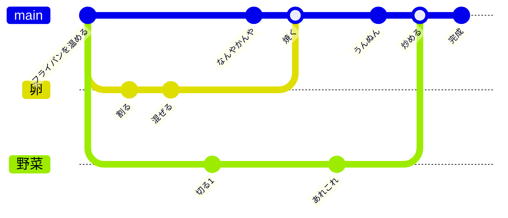

# 一旦ST-GCNを飛ばして補正のアルゴリズムを考えた(ている)

## 出席率
- 3年セミナー：undefined%

## スケジュール
### 短期的な予定
- [ ] お料理中の動作を推定したい
    - [x] ST-GCN っていう機械学習をすればいいらしい
    - [ ] ST-GCN 分からない
        - [x] GCN 完全に理解した
        - [x] GCN で練習問題やる
        - [x] ST-GCN 完全に理解した
        - [ ] ST-GCN で練習問題やる
            - [x] 有名(そう)なデータセットを使えるように申請
            - [x] 申請通った
            - [ ] 既存の論文を参考に練習問題やる
        - [ ] ST-GCN でお料理の動作推定をする
- [ ] 推定結果をお料理の手順から補正したい
    - [x] 推定結果の出力 / 補正への入力を考える
    - [x] レシピをどう構造化するか考える
    - [ ] アルゴリズムを考える (進行中)
    - [ ] プログラム書く (進行中)
- [ ] 評価実験
- [ ] 論文書く


### 長期的な予定
- 2年生のうちに論文書き上げたい

## 進捗報告
## データセットの用意
おそらく本家 https://rose1.ntu.edu.sg/dataset/actionRecognition/

データ量がすごいらしい


もし研究で使うならばちゃんと明記する必要がある
監督者とかの情報も入れる必要がある
https://rose1.ntu.edu.sg/dataset/actionRecognition/request

全然承認されないので先に進めない
追記) 昨夜申請通ってた


## 構造化されたレシピから補正をする
先に楽そうなこっちをやってモチベを上げよう
追記) そんなことなかった

### 技術選定
Pythonちょっと飽きた
TS は Python から呼び出しづらい
Rust → wasm でよいのでは？

#### メリット
- Rust, wasm の勉強ができる
    - 結構モダンな技術
- wasm は色んな言語から扱えるような設計
    - Python でも JS(TS) でも簡単に使える (同じ言語で書いたモジュールと同等)
    - もし、Webアプリ等も作るならすごく簡単に扱える

#### デメリット
- いずれ引き継ぎをするなら可哀想
    - Rust で実装できるなら Python への移植も簡単なはず

### Rust → wasm
#### プロジェクトのセットアップ
```shell
cargo new --lib <project-name>
rustup target add wasm32-unknown-unknown
```

#### Rust を書く
足し算するだけの関数
```rust
#[no_mangle]
pub extern "C" fn add(left: u32, right: u32) -> u32 {
    left + right
}
```

#### ビルド
```shell
cargo build --target wasm32-unknown-unknown --release
cp ./target/wasm32-unknown-unknown/release/deps/cooking_action_estimation.wasm ../src/correction.wasm
```

```
../src-rust/target
├── CACHEDIR.TAG
├── release
│   ├── build
│   ├── deps
│   ├── examples
│   └── incremental
└── wasm32-unknown-unknown
    ├── CACHEDIR.TAG
    └── release
        ├── build
        ├── cooking_action_estimation.d
        ├── cooking_action_estimation.wasm
        ├── deps
        │   ├── cooking_action_estimation.d
        │   └── cooking_action_estimation.wasm # これを使う
        ├── examples
        └── incremental
```

#### Python ← wasm
```shell
pip3 install wasmtime
```

```py
import wasmtime.loader
from correction import add # wasmファイルを直接ipmortできる

answer = add(7, 4)
print("7 + 4 = %d" % answer)
```

すごい
ただし、型が緩かったり...

↓とするとカスタマイズしやすくなる(らしい)
良い感じにすると型をより厳格にできる(ぽい)けど分からない
```py
from typing import Union
from wasmtime import Engine, Func, Module, Store, Instance

engine = Engine()
wasm = open("./correction.wasm", "rb").read()
module = Module(engine, wasm)
store = Store(engine)
instance = Instance(store, module, ())

def add(a: int, b: int) -> Union[int, None]:
    addition = instance.exports(store)["add"]

    if not isinstance(addition, Func):
        return None

    answer = addition(store, a, b)
    return answer


if __name__ == "__main__":
    ans = add(7, 4)
    print(ans)
```

実装可能そうなので Rust+wasm で実装してみることにする

追記) Rust の String型 と C言語(Pythonの本性) では互換性がなく扱いづらかった
→ 大人しく Python で書くことにした

追記) Python では JSON のバリデーションがしづらかった
→ 一旦慣れている TypeScript で軽く実装することにした. 今後Pythonにする(かも)


### レシピの構造化と補正のアルゴリズム
#### レシピの構造化を考える
料理は一直線ではない
※ 今回の伊達巻は一直線



"卵を焼く" には "卵を割る" が必ず来るが
"野菜を切る" の前に "卵を割る" 必要は必須ではない
といったことを表現したい

レシピを簡単に表現したい  
→ yaml で書きたい

#### yaml を定義

- name: 料理名
- url: 参考元
- step: 料理の手順
  - process をIDで参照
  - 上書きも可
- process: 手順の詳細

<span id="レシピ" />

<details>
<summary>yaml</summary>

```yaml
name: 伊達巻き
url: https://www.kikkoman.co.jp/homecook/search/recipe/00055288/
ingredients:
  - name: はんぺん
    quantity: 1
    unit: 枚
  - name: 卵
    quantity: 4
    unit: 個
  - name: 砂糖
    quantity: 1
    unit: 大さじ
  - name: サラダ油
    quantity: 1
    unit: 大さじ
steps:
  - id: ID[はんぺんを千切る]
  - id: ID[卵を割る]
  - id: ID[卵を溶く]
  - id: ID[ペースト状にする]
  - id: ID[濾す]
  - id: ID[油をしく]
  - id: ID[生地を流し込む]
  - id: ID[アルミ蓋を乗せる]
  - id: ID[待つ]
  - id: ID[裏返す]
  - id: ID[巻きすに下ろす]
  - id: ID[卵を巻く]
  - id: ID[生地を流し込む]
  - id: ID[アルミ蓋を乗せる]
  - id: ID[待つ]
  - id: ID[裏返す]
  - id: ID[巻きすに下ろす]
  - id: ID[待つ]
    time: 0:0:10
  - id: ID[卵を巻く]
  - id: ID[待つ]
  - id: ID[切る]
processes:
  - id: ID[待つ]
    title: 待つ
    time: 0:5:0
  - id: ID[はんぺんを千切る]
    title: はんぺんを千切る
    time: 0:0:5
  - id: ID[卵を割る]
    title: 卵を割る
    time: 0:0:5
  - id: ID[卵を溶く]
    title: 卵を溶く
    time: 0:0:5
    required:
      - id: ID[卵を割る]
  - id: ID[ペースト状にする]
    title: ペースト状にする
    time: 0:0:5
    required:
      - id: ID[卵を溶く]
  - id: ID[濾す]
    title: 生地を濾す
    time: 0:0:5
    required:
      - id: ID[ペースト状にする]
  - id: ID[油をしく]
    title: 卵焼き器に油をしく
  - id: ID[生地を流し込む]
    title: 卵焼き器に生地を流し込む
    required:
      - id: ID[濾す]
      - id: ID[油をしく]
  - id: ID[アルミ蓋を乗せる]
    title: アルミ蓋を乗せる
    required:
      - id: ID[生地を流し込む]
  - id: ID[裏返す]
    title: 生地を裏返す
    required:
      - id: ID[生地を流し込む]
  - id: ID[巻きすに下ろす]
    title: 巻きすに下ろす
    required:
      - id: ID[生地を流し込む]
  - id: ID[卵を巻く]
    title: 卵を巻く
    required:
      - id: ID[巻きすに下ろす]
  - id: ID[切る]
    title: 切る
    required:
      - id: ID[卵を巻く]
```

</details>

TODO: 今後エディタ用にschemaを定義する

#### 推定ターンの出力 / 補正ターンへの入力
推定結果ってどうなってるんだろう
[参考元の論文](https://arxiv.org/pdf/1801.07455)

データセットの時間
> avg:  84.51153305203938
> max:  300
> min:  26

入力は1動作の区切りがわかっている状態
今回はどこまでが1動作か分からない

n秒ごとにウィンドウに区切って推定するのがよさそう？
（n は 2~30秒? ST-GCN次第）

となると↓

<span id="推定" />

```js
[
  {
    "start": 0,
    "end": 10,
    "estimation": [
      {
        "probability": 0.8, // 確信度
        "label": 0, // 推定結果のラベル
        "id": "ID[はんぺんを千切る]", // レシピの手順ID
      },
      {
        "probability": 0.15,
        "label": 1,
        "title": "ID[卵を割る]"
      },
      ...
    ]
  },
  ...
]
```

#### アルゴリズム
#### v1
1. 確信度が高いものを信用する
    - きっと細かかくなる
    - 
    - （上が一番確信度が高いもの, 下が2番目としている）
2. 隣と確信度2番目を見て空気を読む
    - (周りを見て確信度を上げ下げする)
    - どこまで隣を見るかは1動作にかかる時間くらい?
    - 
    - 赤) 周り青だし空気読んどこ...
    - 青) 前後の青の確信度高めだし間違ってないやろ...
3. お料理の手順を考慮する
    - 必ず [レシピ(yaml)](#レシピ) のrequiredの順になるようにする
    - 順番が入れ替わっていた場合は、どうしようかな
    - どちらかが合っていると仮定して都合がいい方を選ぶ感じ(数独みたいな)

※上(確信度1番目)と下(確信度2番目)が同じにはならないけど、面倒だから修正してない

#### v2
- 0秒目から見ていく
- 手順通りの動作でない / 細かすぎる場合
    - 次の動作であれば次の動作に移ったとする
    - 次の動作でない場合
        - 確信度2番目と前後を参考に現在の動作 / 次の動作の可能性を考慮する
            - 現在の動作 / 次の動作でもない場合は undefined にする
- 全ての時間を見たらundefinedを前後の動作を元に埋める

最新版 → https://kjlb.esa.io/posts/6457

## 進路関係
### pluszero
長期インターン(バイト)中

### 総研大 極域科学コース
極地研究所に設置されている総研大の大学院のコース
極域科学は北極と南極を主軸として研究している

- 極域宙空圏
- 極域気水圏
- 極域地圏
- 極域生物圏
のグループがある[参考](https://www.nipr.ac.jp/soken/outline/)

極域生物圏には
- 極地の海の小さな生物（植物プランクトン、動物プランクトンなど）を調べるチーム
- **極地の海の大きな生物（海鳥、ペンギン、アザラシなど）を調べるチーム**
- 極地の陸上や湖沼の生物を調べるチーム
がある [参考](https://www.nipr.ac.jp/research/group/#biology)

動物行動学 を学びたい
動物 x センシング って夢の塊

> 高橋 晃周 （教授）
> 海洋生態系の高次捕食者である大型動物（海鳥・海生哺乳類など）の行動学・生態学について研究・教育を行っている。水中を自由に動き回る海洋大型動物は直接観察することが難しく、行動・生態についての知見はこれまで極めて限られていた。近年極地研グループが中心となって動物に装着可能な小型記録計が開発され、潜水など様々な行動情報が詳細に記録できるようになった。また小型画像記録計などにより動物の周辺の環境情報も得られるようになってきている。このような記録計をもちいながら、極域に生息する大型動物の環境変動に対する応答、極限環境における生存戦略について研究している。

> 國分 亙彦 （助教）
> 動物に装着可能な小型機器（データロガー）を海洋性高次捕食者である海鳥類に取り付けることで、行動・生態やその周辺の海洋環境を明らかにする研究に中心的に取り組んでいる。特に、高次捕食動物の生存に必要不可欠な採餌行動に着目し、これまで可視化することの難しかった採餌の詳細なタイミング・場所を詳細に調べ、衛星による環境データ等とも組み合わせることで採餌にとって重要な海洋環境を明らかにしている。このような視点から、海洋性高次捕食者を指標として、近年注目されている、極域の急激な海洋環境変化が、海洋生態系に及ぼす影響を探っている。

結構行きたい


#### 難易度について
学生の方が TOEIC 500-600 くらいって言ってた
TOEIC 590点がベースって書いてあった

専門教科は好きなの選べばいいからなんとかなる(希望)

面接が最重要らしい(どこの院もそうらしい)(知らなかった)
何を研究したくてこれまでの何をどう生かすかみたいな
志望動機5分 → 質疑応答など15分

小論文は知らん

一旦3年上がったくらいに(論文が書き終わるだろうから)連絡をとってみようと思う
院進は研究室(教授)とのやりとりが重要ぽい
いつでも研究室見学できるらしい
1回だけ総研大が交通費出してくれるらしい


## 余談
### B3 HackU の打ち上げに参戦した
名目上は HackU の合同打ち上げです


### TGS に行った
友達と後輩が頑張ってたから覗いた(30分だけ)


### 総研大(極地研究所) 行ってきた


アデリーペンギンの剥製
親はカチカチ雛はふわっふわで骸骨はずっしりって感じ
足は使用済みタイヤみたいな
尾線触り忘れてた


照度計で日の出日の入り時刻を取得することで位置を推定できるらしい(すごい)
GPSほど精度は高くないが電池が1年持つらしい(すごい)


### 滝山城いった


ヤギかわいい


### 原首相現場に立ち寄った
堂々とひっそりと佇んでいて誰の視界にも止まっていないのになんとも言えない歴史の趣きを感じた


